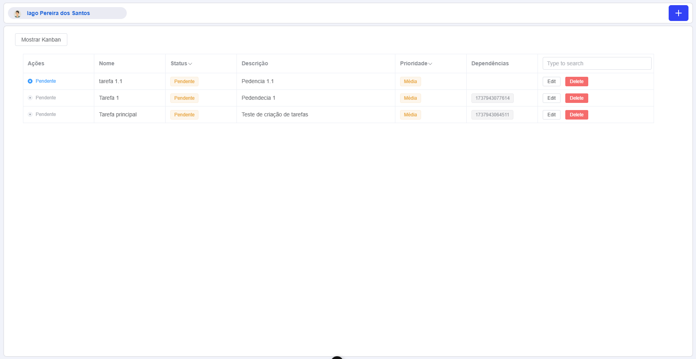

# Todo-Nectar: Vue Todo List

Este projeto é uma aplicação de lista de tarefas (Todo List) desenvolvida utilizando Vue 3 e Vite. O objetivo é criar uma aplicação simples, rápida e moderna para gerenciamento de tarefas, com suporte a testes e configuração de desenvolvimento eficiente. Este desafio foca na criação de uma aplicação escalável com Vue.js, organizando os componentes em uma hierarquia eficiente, otimizando o desempenho da aplicação e aplicando boas práticas de arquitetura.

## Tecnologias Utilizadas

- [Vue 3](https://vuejs.org/): Framework progressivo para construção de interfaces de usuário.
- [Vite](https://vitejs.dev/): Ferramenta de build rápida e moderna.
- [pnpm](https://pnpm.io/): Gerenciador de pacotes eficiente.
- [Jest](https://jestjs.io/): Framework para testes unitários.
- [ESLint](https://eslint.org/): Ferramenta para garantir a qualidade e consistência do código.

## Configuração Recomendável de IDE

- [VSCode](https://code.visualstudio.com/): Editor de código recomendado.
- [Volar](https://marketplace.visualstudio.com/items?itemName=Vue.volar): Extensão para suporte ao Vue 3. (Desative o Vetur para evitar conflitos.)

## Como Configurar o Projeto

### Instalação de Dependências

Utilize o `pnpm` para instalar as dependências do projeto:

```sh
pnpm install
```

### Executar o Ambiente de Desenvolvimento

Para compilar e executar o projeto em modo de desenvolvimento com recarregamento automático:

```sh
pnpm dev
```

### Gerar Versão de Produção

Para compilar e minificar o projeto para produção:

```sh
pnpm build
```

### Testes Unitários com Jest

Para rodar os testes unitários:

```sh
pnpm test
```

### Verificação de Qualidade de Código com ESLint

Para executar a lintagem do código e garantir a qualidade e consistência:

```sh
pnpm lint
```

### Estrutura do Projeto

```plaintext
/
├── src/             # Código fonte do projeto
│   ├── components/ # Componentes Vue reutilizáveis
│   ├── views/       # Páginas principais da aplicação
│   ├── store/       # Gerenciamento de estado (opcional)
│   └── assets/      # Recursos estáticos (imagens, estilos, etc.)
├── public/         # Arquivos estáticos
├── tests/          # Testes unitários e outros
├── vite.config.ts  # Configuração do Vite
└── package.json    # Configuração do projeto e scripts
```

## Scripts Disponíveis

- `pnpm dev`: Executa o ambiente de desenvolvimento.
- `pnpm build`: Compila o projeto para produção.
- `pnpm test`: Executa os testes unitários com Jest.
- `pnpm lint`: Executa o ESLint para verificar a qualidade do código.


